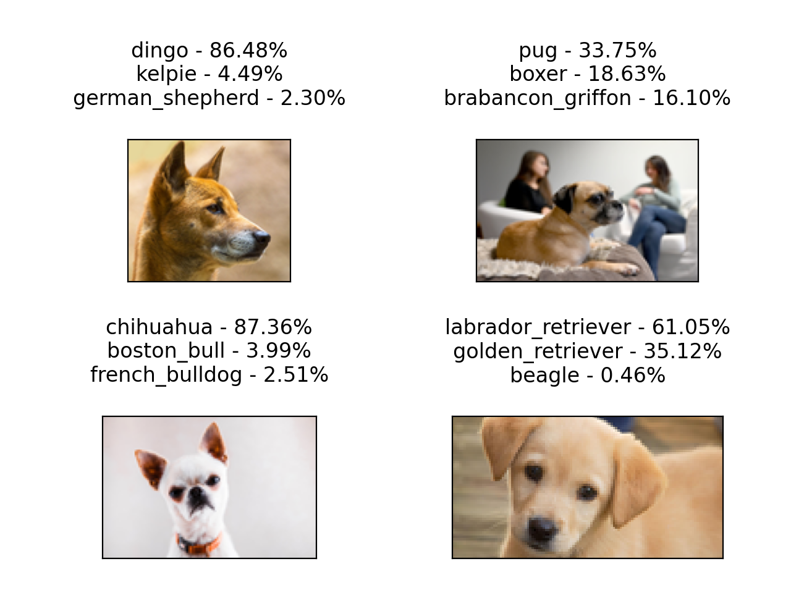
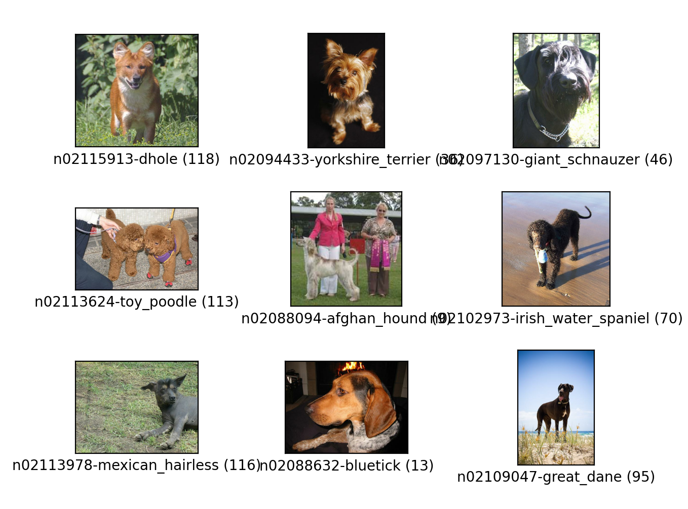
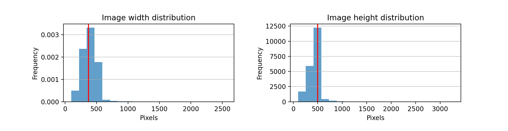
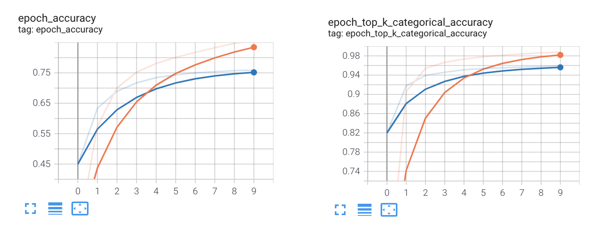

# Stanford Dogs Classifier
This project builds a classifier that can predict dog breeds from images. The classifier is trained on the [stanford_dogs](https://www.tensorflow.org/datasets/catalog/stanford_dogs) TensorFlow dataset.



## Contents
1. [Intallation and Setup](#Intallation-and-Setup)
2. [Run](#Run)
3. [Tutorial](#Tutorial)
   * [Download and preprocess dataset](#Download-and-preprocess-dataset)
   * [Create a machine learning model](#Create-a-machine-learning-model)
   * [Train the model](#Train-the-model)
   * [Test model performance](#Test-model-performance)
4. [Conclusion](#Conclusion)

## Installation and Setup

Clone this repository.
```
git clone https://github.com/aribiswas/stanford-dogs-classifier.git
```

The required packages for this project are specified in a ***requirements.txt*** file. You can create a virtual environment from the requirements file for this project. I use Anaconda for managing environments and the following steps are specific to it, but you can use any other environment manager of your choice. 

Miniconda is a lightweight version of Anaconda. You can download and install Miniconda from [here](https://docs.conda.io/en/latest/miniconda.html).

Once installed, navigate to the cloned repository and create a virtual environment:
```
conda create --name <YOUR-ENV-NAME> --file requirements.txt
```
Activate the environment and you are ready to run the project.
```
conda activate <YOUR-ENV-NAME>
```

## Run

The entry point script for this project is ***[run.py](https://github.com/aribiswas/stanford-dogs-classifier/blob/master/run.py)***. You can use this script to identify dog breeds from image URLs.

From the project root execute the entry point script. This will prompt you to enter the URL of an image that you want to identify.
```
python run.py
Enter an url for the image, 0 to quit: 
```
Try this image: https://media.nature.com/lw800/magazine-assets/d41586-020-03053-2/d41586-020-03053-2_18533904.jpg

Altenately, you can provide many URLs as command line arguments.
```
python run.py --url <url1> <url2> ...
```

## Tutorial

The goal of this project is to build a classifier that can accurately predict dog breeds from images. I used TensorFlow 2.0 to train a model on the [standford-dogs](https://www.tensorflow.org/datasets/catalog/stanford_dogs) TensorFlow Dataset. The dataset contains images of 120 dog breeds from around the world.

### Download and preprocess dataset

The ***[dataprocessor.py](https://github.com/aribiswas/stanford-dogs-classifier/blob/master/dataprocessor.py)*** module contains functions to download and preprocess the images.

First, download the dataset to the project folder. You can use the *[tfds.load](https://www.tensorflow.org/datasets/api_docs/python/tfds/load)* method to download the dataset.
```
import tensorflow as tf
import tensorflow_datasets as tfds

def load_dataset():
    (ds_train, ds_test), ds_info = tfds.load(
                                           'stanford_dogs', 
                                            split=['train', 'test'],
                                            shuffle_files=True,
                                            as_supervised=False,
                                            with_info=True,
                                            data_dir='data/tfds'
                                          )
    return ds_train, ds_test, ds_info
```

After downloading, lets view a few sample images from the dataset. You can use the *[tfds.show_examples()](https://www.tensorflow.org/datasets/api_docs/python/tfds/visualization/show_examples)* method.
```
ds_train, _, ds_info = load_dataset()
tfds.show_examples(ds_train, ds_info)
```



Notice that the images have different sizes. In order to train an accurate model from these images, you will need to resize them to a common size. An analysis of image dimension distributions from the dataset is shown below. The red line shows the dimension (in pixels) with maximum frequency. We can infer that most images have width and height between 200-500 pixels.

To generate the histograms, you can use the  *[analyze](https://github.com/aribiswas/stanford-dogs-classifier/blob/beaea1f0604228b85ab1770c8eb0760d101e7b07/dataprocessor.py#L75)* function in *dataprocessor.py*.
```
import dataprocessor as proc
proc.analyze()
```


I chose to resize all images to (224,224) which is the dimension from the MobileNetV2 paper. In addition to resizing, I also cast the images to float, normalized the image between 0 and 1 and one hot encoded the labels. 

Following is a function that performs the preprocessing on the dataset. You can use this function to create a data pipeline for training and validation.
```
def preprocess(data):
    image_size = (224, 224)
    num_labels = 120
    processed_image = data['image']
    label = data['label']
    processed_image = tf.cast(processed_image, tf.float32)
    processed_image = tf.image.resize(processed_image, image_size, method='nearest')
    processed_image = processed_image / 255.
    label = tf.one_hot(label, num_labels)
    return processed_image, label
```

The *[tfds.map()](https://www.tensorflow.org/api_docs/python/tf/data/Dataset#map)* method can be used to transform each entry i.e. (image,label) pair from the dataset by applying a process function on the entries. In our case, we can use the *preprocess* function to process the entire dataset. In addition to processing the images and labels, you can use buffered prefetching to load the data from disk without any blockage. More information on this [here](https://www.tensorflow.org/guide/data_performance).
```
def prepare(dataset):
    dataset = dataset.map(preprocess, num_parallel_calls=tf.data.AUTOTUNE)
    dataset = dataset.cache()
    dataset = dataset.batch(32)
    dataset = dataset.prefetch(buffer_size=tf.data.AUTOTUNE)
    return dataset
```

### Create a machine learning model

For this project I used a model architecture based on the [MobileNetV2](https://arxiv.org/abs/1801.04381) network to classify the images. Open ***[model.py](https://github.com/aribiswas/stanford-dogs-classifier/blob/master/model.py)*** to see other network architectures and feel free to experiment with them.

First, create a base model using *[tf.keras.applications.MobileNetV2](https://www.tensorflow.org/api_docs/python/tf/keras/applications/mobilenet_v2/MobileNetV2)* with trained weights. The include_top=False flag removes the fully connected layer at the top of the network. The base model will not be trainable and will be used to extract features from the images. The trainable part consists of a Dense layer that outputs the dog breed probabilities.

The code is shown below.
```
def mobilenet(image_shape, num_classes, lr=0.001):
    base_model = tf.keras.applications.MobileNetV2(input_shape=image_shape,
                                                   include_top=False,
                                                   weights='imagenet')
    base_model.trainable = False
    model = tf.keras.Sequential([
        base_model,
        tf.keras.layers.GlobalAveragePooling2D(),
        tf.keras.layers.Dense(num_classes, activation='softmax')
    ])

    model.compile(
        optimizer=tf.keras.optimizers.Adam(lr),
        loss='categorical_crossentropy',
        metrics=['accuracy', 'top_k_categorical_accuracy']
    )
    return model
```

### Train the model
Once the model is created, you are ready to train. Take a quick look at the training functions defined in the ***[trainer.py](https://github.com/aribiswas/stanford-dogs-classifier/blob/master/trainer.py)*** module. 

Load the dataset and prepare the train and test batches.
```
ds_train, ds_test, ds_info = load_dataset()

train_batches = prepare(ds_train)
test_batches  = prepare(ds_test)
```

Training is pretty simple to set up using the *[tf.keras.Model.fit()](https://www.tensorflow.org/api_docs/python/tf/keras/Model#fit)* method.
```
net.fit(
        train_batches,
        epochs=10,
        validation_data=test_batches
       )
```

You can also specify callbacks for visualization and saving the model's weights.
```
# Create a callback for visualization in TensorBoard
# This will save training metrics inside the "logs" folder 
tensorboard_callback = tf.keras.callbacks.TensorBoard(log_dir="logs",
                                                      histogram_freq=1,
                                                      profile_batch=0 )
						      
# Create a callback that saves the model's weights
cp_callback = tf.keras.callbacks.ModelCheckpoint(filepath="checkpoints/model.ckpt",
                                                 save_weights_only=True,
                                                 verbose=1 )

# Train
net.fit(
        train_batches,
        epochs=10,
        validation_data=test_batches,
        callbacks=[tensorboard_callback, cp_callback]
       )

# Save the model weights
net.save("trained_models/model_1.h5")
```

To visualize the training progress using TensorBoard, execute the following command in a new terminal.
```
tensorboard --logdir logs
```

This will output something like this.
```
Serving TensorBoard on localhost; to expose to the network, use a proxy or pass --bind_all
TensorBoard 2.5.0 at http://localhost:6006/ (Press CTRL+C to quit)
```
Click on the link to view the training progress in a browser.

The model achieved around 83% accuracy (training) and 75% accuracy (validation). The top-k categorical accuracy was significantly higher at 98% (training) and 95% (validation). The results are shown below.



Overall, the model achieved reasonable results after training. You can test the performance of the model using the ***run.py*** script.

### Test model performance

Use the trained model to predict dog breeds. The ***[classify.py](https://github.com/aribiswas/stanford-dogs-classifier/blob/master/classify.py)*** module contains the APIs for prediction.

Load the model.
```
model = tf.keras.models.load_model("trained_models/model_1.h5")
```
Write a function to make predictions.
```
def predict(x, top_k=5):
    input_shape = model.layers[0].input_shape[1:]
    if tf.is_tensor(x):
        x = tf.reshape(x[0], [1] + list(input_shape))
    elif isinstance(x, numpy.ndarray):
        assert x.shape == input_shape
        x = tf.reshape(x, [1] + list(input_shape))

    # predict
    pred = model.predict(x)
    top_k_pred, top_k_indices = tf.math.top_k(pred, k=top_k)

    # display the prediction
    predictions = dict()
    for ct in range(top_k):
        name = ds_info.features['label'].int2str(top_k_indices[0][ct])
        name = "".join(name.split('-')[1:])
        value = top_k_pred.numpy()[0][ct]
        predictions[name] = value
        print(name + " : {:.2f}%".format(value*100))
	
    return predictions
```

Load an image from a URL, make sure to resize the image to (224,224) before calling the *predict* function.
```
url = "https://media.nature.com/lw800/magazine-assets/d41586-020-03053-2/d41586-020-03053-2_18533904.jpg"
file_name = "downloaded_image.jpg"
image_file = tf.keras.utils.get_file(file_name, url, extract=True)
img = tf.keras.preprocessing.image.load_img(image_file).resize((224,224))
```

Make the predictions.
```
predictions = predict(img, top_k=3)

dingo : 86.48%
kelpie : 4.49%
german_shepherd : 2.30%
```

## Conclusion

This project covers the basics of image classification. In the future I intend to develop a deployment workflow for this project. 

Please feel free to provide any feedback.
